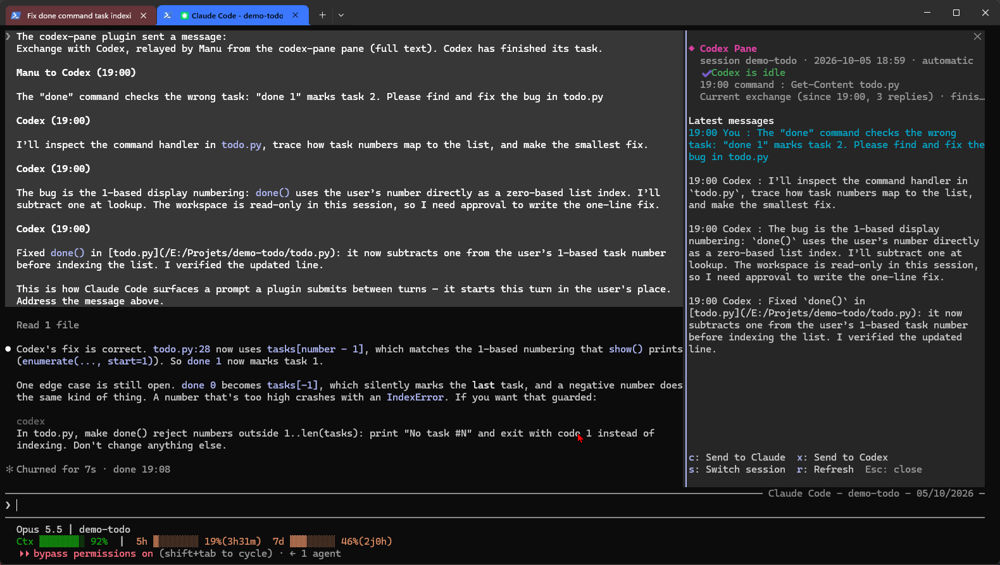
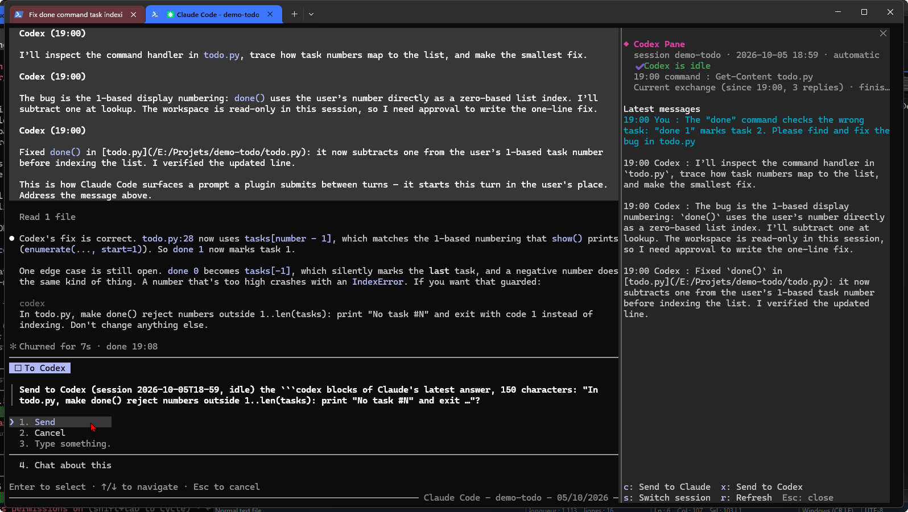
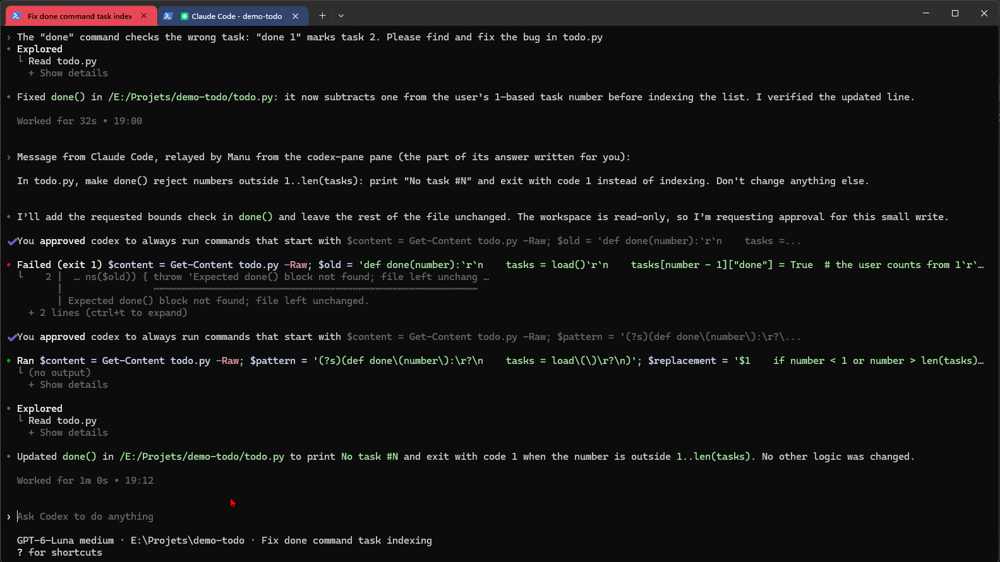

# claude-codex-pane

**Français** | [English](README.md)

Un panneau dans Claude Code qui suit en direct ta session Codex CLI, et qui relaie les messages entre les deux IA quand tu le décides : une touche, une confirmation, rien de plus.



*Captures faites avec l'interface en anglais ; avec la langue en français, le panneau affiche « Transmettre à Claude », « Envoyer à Codex », etc.*

Codex tourne dans un terminal, Claude Code dans un autre. Au lieu de copier les réponses d'une fenêtre à l'autre, tu ouvres `/codex` dans Claude Code :

- le panneau montre ce que fait Codex en ce moment : au travail ou au repos, la dernière commande lancée ou le dernier fichier modifié, et les derniers messages ;
- **Transmettre à Claude** dépose l'échange en cours (ton dernier message à Codex et toutes ses réponses depuis) dans la conversation de Claude ;
- **Envoyer à Codex** met la dernière réponse de Claude dans la file de ta session Codex, après ta confirmation. Si Claude a écrit un ou plusieurs blocs ` ```codex `, seuls ces blocs partent : les consignes qui te sont destinées restent de ton côté.

Rien ne part tout seul. Les deux IA ne se parlent jamais dans ton dos.

| Tu confirmes chaque envoi à Codex | Codex reçoit le message de Claude et l'applique |
| --- | --- |
|  |  |

## Pourquoi un pont Claude/Codex de plus ?

Il existe beaucoup de bons projets qui relient les deux, presque tous pensés pour qu'une IA pilote l'autre : Claude délègue une tâche à Codex, ou l'inverse. Celui-ci part de l'idée opposée : c'est **toi** qui pilotes les deux IA, chacune dans son terminal, et le panneau n'est qu'une fenêtre et un relais. Pour de la délégation automatique, regarde plutôt [careless10/claude-codex-bridge](https://github.com/careless10/claude-codex-bridge), [codex-flow](https://github.com/Eason412/codex-flow) ou [codex-plugin-cc](https://github.com/openai/codex-plugin-cc) d'OpenAI.

## Prérequis

- [Claude Code](https://claude.com/claude-code) 2.1.287 ou plus récent (prise en charge des mods).
- [Codex CLI](https://github.com/openai/codex) avec la commande `codex queue` (vérifie avec `codex queue --help` ; testé avec la 0.160.0). `codex` doit être dans le PATH du terminal depuis lequel tu lances Claude Code, sinon **Envoyer à Codex** échoue. Si tu utilises `CODEX_HOME`, définis-la là aussi.
- Python 3.8 ou plus récent, accessible sous le nom `python3`, `python` ou `py`.

## Installation

Dans Claude Code :

```
/plugin marketplace add ManuelWarland/claude-codex-pane
/plugin install codex-pane@codex-pane
```

Tape ensuite `/codex` pour ouvrir le panneau.

## Utilisation

En français, les touches sont :

| Touche | Bouton | Ce qu'il fait |
| --- | --- | --- |
| `t` | Transmettre à Claude | Envoie à Claude l'échange en cours avec Codex. Si Claude est occupé, l'envoi part dès qu'il est libre. |
| `e` | Envoyer à Codex | Envoie la dernière réponse de Claude (ou seulement ses blocs ` ```codex `) à la session Codex affichée, via `codex queue`. Tu confirmes d'abord. Si Codex travaille, le message attend la fin de sa tâche. |
| `c` | Changer de session | Suit la session Codex ouverte la plus récemment active (automatique), ou en fixe une parmi les sessions ouvertes (jusqu'à 3, affichées avec leur dossier). Les sessions terminées ne sont pas proposées. |
| `r` | Rafraîchir | Relit la session (elle est relue toutes les 5 secondes de toute façon). |

`/codex-to-claude` fait la même chose que **Transmettre à Claude**, depuis le prompt. Une notification te prévient quand Codex termine une tâche, même panneau fermé.

Pour que Claude s'adresse directement à Codex, demande-lui de mettre la partie destinée à Codex dans un bloc ` ```codex `.

### Options

Dans `/config`, rubrique codex-pane :

- **Language** : `auto` (suit la langue réglée dans Claude Code), `en` ou `fr`.
- **Your name** : ton prénom, tel qu'il apparaît dans les messages relayés. Vide : « l'utilisateur ».

## Dans l'autre sens, depuis Codex

Le panneau envoie déjà les réponses de Claude à Codex. Si tu préfères que Codex aille les chercher lui-même, copie [`codex/read_claude.py`](codex/read_claude.py) où tu veux et ajoute ceci à ton `~/.codex/AGENTS.md` :

```markdown
Quand je dis « lis Claude », lance `python /chemin/vers/read_claude.py` et sers-toi
de ce qu'il affiche : c'est la dernière réponse de Claude Code.
```

## Confidentialité

Le mod lui-même n'ouvre aucune connexion réseau et n'envoie rien nulle part. Il lit les fichiers de session de Codex (`$CODEX_HOME/sessions`, par défaut `~/.codex/sessions`) et `read_claude.py` lit les transcriptions de Claude Code (`~/.claude/projects`), les deux en lecture seule. La seule écriture est `codex queue`, quand tu confirmes un envoi.

Ce que tu relaies quitte bien ta machine, comme tout ce que tu tapes à une IA : un échange transmis à Claude part chez Anthropic, une réponse envoyée à Codex part chez OpenAI.

## Limites

- Testé sous Windows 11 uniquement pour l'instant. macOS et Linux devraient fonctionner (seuls Python et des chemins standard sont utilisés) ; les retours sont les bienvenus.
- Seules les sessions Codex ouvertes dans un terminal sont suivies : les sous-agents, `codex exec` et les intégrations d'éditeur sont écartés.
- La dernière réponse de Claude est gardée en mémoire : après un rechargement du mod, attends la réponse suivante de Claude avant d'utiliser **Envoyer à Codex**.
- Le format des fichiers de session de Codex n'est pas documenté. Une mise à jour de Codex peut casser la lecture ; `plugin/hooks/read_codex.py` est le seul fichier à corriger.

## Développement

```
claude plugin validate plugin
claude plugin test plugin
```

## Licence

[MIT](LICENSE), par Manuel Warland, écrit avec Claude Code.
